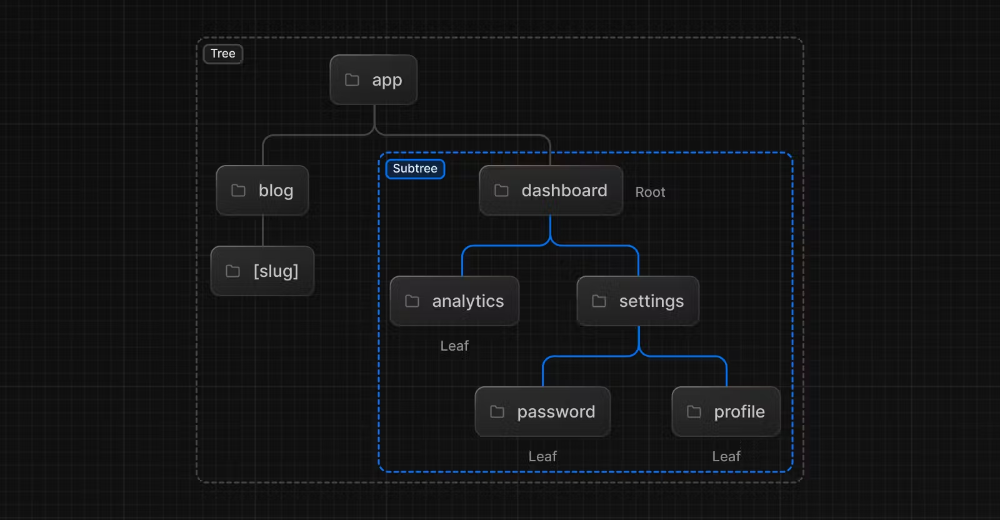
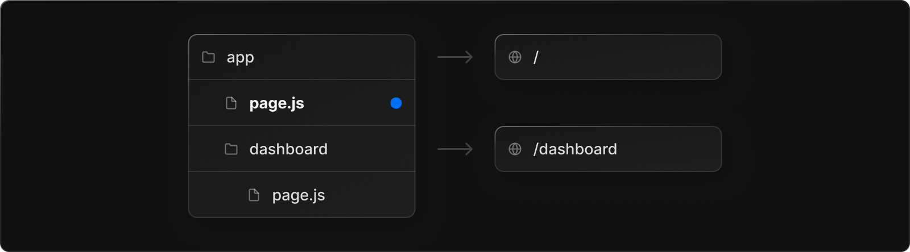
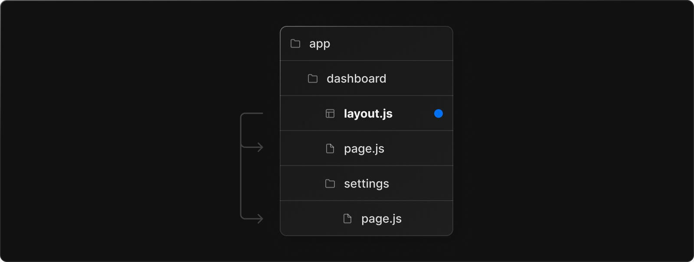
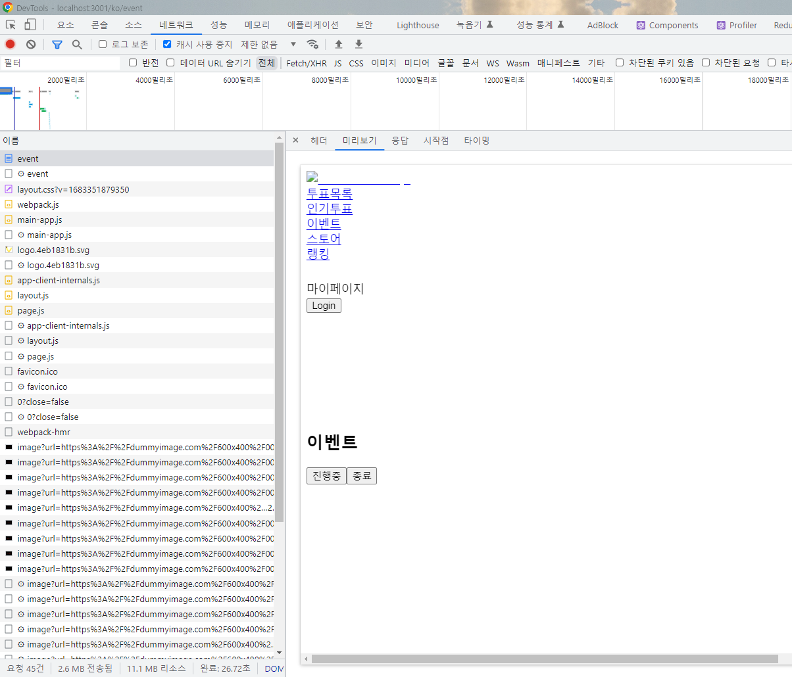
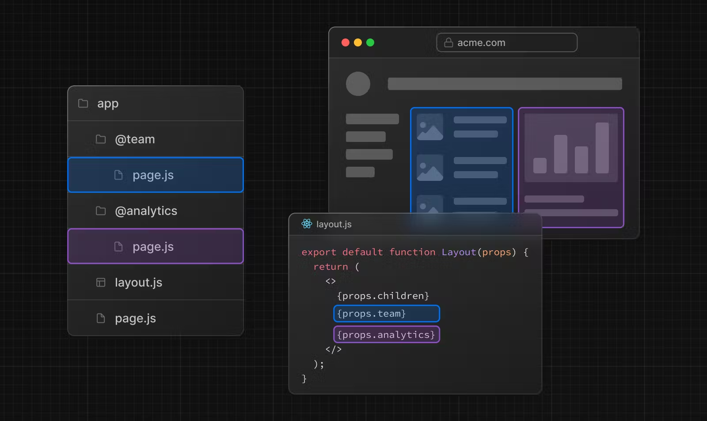

# Next.js 13.4 버전 정리

Next.js 13의 공식 문서

[https://nextjs.org/docs](https://nextjs.org/docs)

Next.js 13을 사용한 이유

작년부터 Next.js가 완전 새로운 방식으로 라우팅을 한다는 소식을 들었으나 개발 초창기인 만큼 page구조에서 app 구조로 넘어갈 이유를 느끼지 못했다.

그러나 최근 들어서 공식 문서의 로드맵을 봤을 때 많은 기능이 개발되어 있었으며 개발하는데 참고 할 만한 문서나 프로젝트들의 수가 충분히 쌓였다고 생각했다. 그리고 이미 저번 프로젝트를 진행하면서 Next.js를 사용했기 때문에 이번에는 새로운 것들을 더 공부하고 싶은 생각이 더 강해서 베타버전을 사용하여 진행하기로 결정 하였다.

## 전 버전과의 차이점 요약

---

- 가장 간단하게만 살펴 본다면 파일 구조면에서 크게 달라졌다. 기존의 pages에서 출발하던 루트 경로는 app이라는 폴더 이름으로 변경 되었으며 그 안에서 몇가지 규칙이 생겼다.
- 서버 사이드 렌더링이 기본적으로 돌아가게 된다. 클라이언트 사이드 렌더링이 필요한 함수 대표적으로 “useEffect”, “useState” 등을 사용 하려면 정해진 규칙(상단에 “use client”)을 사용해야만 한다.
- i18next를 공식으로 지원하여 다국어 지원을 좀 더 쉽게 할 수 있다.

## Next.js 13.4의 기능

---

### 라우팅

가장 큰 차이점이라고 한다면 라우팅 구조를 볼 수 있다.

지금까지의 Next.js의 루트 폴더는 pages였으나 이번 버전에서는 app폴더를 루트로 잡는다.

이 app 폴더에는 지난 버전과 마찬가지로 api 폴더가 존재하며 url은 app의 하위 폴더명을 기준으로 url을 설정한다.

이 과정에서 중첩 경로를 설정할 수 있다.

중첩 경로란 만약 app 폴더 하위에 dashboard 폴더가 있고 그 하위에 settings 폴더가 있다면 이 부분의 url은 `/dashboard/setting`이 되며 이 url은 `/, /dashboard, /dashboard/setting` 3개의 페이지로 구성 되어있다는 것을 의미한다.

그리고 Next.js 13에선 부분 렌더링도 할 수 있다.



만약 dashboard라는 같은 부모를 둔 형제간의 경로를 탐색할 때 Next.js는 변경되는 경로의 레이아웃과 페이지만 가져와서 렌더링 한다.

예를 들어 `/dashboard` 라는 폴더가 있고 각각 `/dashboard/settings`와 `/dashboard/analytics`라는 형제 폴더가 존재한다면 각각의 형제 폴더를 접근 했을 때 settings 부분만 렌더링 하고 analytics 부분만 렌더링 한다는 것이다.

전체의 화면을 다시 가져오지 않기 때문에 전송되는 데이터 양과 실행시간이 줄어들어 성능이 향상 된다.

### 고급 라우팅 패턴

고급 라우팅 패턴을 사용하면 병렬 경로, 경로 가로채기, 조건부 경로를 구현 할 수 있다. 각각의 항목에 대해 설명하자면

- 병렬 경로
  - 독립적으로 탐색할 수 있는 동일한 보기에서 두 개 이상의 페이지를 동시에 표시할 수 있다. 자체 하위 탐색이 있는 분할 보기에 사용할 수 있다.
  - 예를 들어 대시보드 같은 경우 하나의 페이지 안에서 두 개 이상의 페이지를 표현할 수 있다.
- 경로 가로채기
  - 경로를 가로채서 다른 경로의 컨텍스트에 표시할 수 있습니다. 현재 페이지의 컨텍스트를 유지하는 것이 중요할 때 사용할 수 있다.
  - 예를 들어 하나의 작업을 편집하거나 피드에서 사진을 확장하는 동안 모든 작업을 볼 수 있습니다. 모달 같은 경우를 예로 들 수 있다.
- 조건부 경로
  - 조건에 따라 경로를 조건부로 렌더링 할 수 있다.
  - 예를 들어 사용자가 로그인한 경우에만 페이지를 표시할 수 있다.

### 파일 규칙

라우팅에서 이어지는 글이다. 이 규칙대로 파일 이름을 설정 해야 Next.js에서 인식하고 경로를 만들거나 레이아웃을 설정할 수 있다.

- page.js
  - 경로의 고유한 UI를 만들고 경로에 공개적으로 액세스할 수 있도록 한다.
  - pages 폴더 방식과는 다르게 page.tsx는 url 주소에 포함이 되지 않는다.
  - 폴더 안에 하나의 page.tsx만 존재할 수 있다.
- layout.tsx
  - 현재 페이지와 하위 페이지들을 감싸는 공유 UI를 만든다.
  - root layout은 절대로 클라이언트 사이드 렌더링을 해서는 안된다. Next.js가 렌더링 하는 순서가 root layout이 제일 먼저 렌더링 되기 때문에 이부분을 클라이언트 사이드 렌더링을 하게 되면 사실상 모든 페이지가 클라이언트 사이드 렌더링으로 돌아가기 때문에 조심해야한다.
  - layout과 비슷해 보이지만 다른 역할을 하는 것으로는 template가 있다.
    - template: 컴포넌트를 교체 하거나 새로운 컴포넌트를 그릴때 template로 감싸져 있는 모든 요소가 새로운 DOM 요소로 다시 새로 만들게 된다. 이따끔씩 이걸 사용 할 필요가 있지만 대부분은 필요가 없기 때문에 Next.js 팀에서도 권장하지는 않는다.
- error.tsx
  - 에러가 발생했을 때를 위한 오류 UI를 만든다.
  - React Error Boundary에서 페이지 또는 하위 페이지 혹은 컴포넌트를 감싸고 오류가 발생하면 이곳에서 정의한 오류 UI를 표시한다.
  - global-error.tsx
    - layout.tsx와 비슷하지만 루트에서 오류를 잡는 데 사용된다.
- not-found.tsx
  - 주소를 입력하고 들어갔으나 없는 페이지의 경우 표시할 UI다.
- loading.tsx
  - 지금 접속한 페이지나 하위 컴포넌트들에 대한 로딩 UI를 생성한다.
  - React Suspense Boundary에서 페이지 또는 하위 세그먼트를 감싸서 로딩하는 동안 정의한 UI 가 표시된다.

> pages에서 app으로 넘어가는 마이그레이션을 위해 두개의 폴더를 동시에 사용할 수 있도록 둘 다 지원 하고 있다.

서버 사이드 렌더링을 한다면 상관 없지만 클라이언트 사이드 렌더링을 하게 된다면 “use client”라는 예약어를 파일 제일 상단에 적어서 사용해야 한다.

### Page 및 Layout

- page.tsx
  
  - 경로의 고유한 UI
  - page.tsx를 구성하고 export 하면 경로에 접근 했을 때 page.tsx에 정의한 내용이 나타납니다.
- layout.tsx
  

  ```tsx
  export default function Layout({
    children, // will be a page or nested layout
  }: {
    children: React.ReactNode;
  }) {
    return (
      <section>
        {/* Include shared UI here e.g. a header or sidebar */}
        <nav></nav>

        {children}
      </section>
    );
  }
  ```

  - 여러 페이지간에 공유되는 UI
  - 레이아웃은 중첩될 수 있고 상태를 유지하며 다시 렌더링 되지 않는다.
  - 자식을 가져야 하는 경우 children을 통해 props를 넘겨주어야 한다.

<aside>
💡 알아두면 좋은 것들

1. 최상위 layout을 루트 레이아웃이라고 하며 애플리케이션의 모든 페이지에서 공유된다. 이 루트 레이아웃에는 html과 body태그를 포함해야한다. (pages의 \_documents.tsx의 역할을 대신 한다고 이해하면 된다.)

2. 모든 경로는 자체 레이아웃을 가질 수 있다. 이 레이아웃은 해당 폴더 구조의 모든 페이지에 공유된다.

3. 경로의 레이아웃은 기본적으로 중첩 된다. 각 상위 레이아웃은 하위 레이아웃을 children으로 감싼다.

4. 레이아웃은 기본적으로 서버 사이드로 동작하지만 “use client”를 통해 클라이언트 사이드로 설정할 수 있다.

5. 상위 레이아웃이 하위 레이아웃에 데이터를 전달 할 수 없다.
</aside>

- root layout

  ```tsx
  //루트 레이아웃

  export default function RootLayout({
    children,
  }: {
    children: React.ReactNode;
  }) {
    return (
      <html lang="en">
        <body>{children}</body>
      </html>
    );
  }
  ```

  - 루트 레이아웃은 필수로 존재해야 하며 모든것들의 최상위에 존재해야한다. app의 모든 경로에 적용된다. 이 레이아웃을 이용하면 서버에서 응답받는 초기 HTML을 수정할 수 있다.
  - 경로 폴더 그룹을 이용하면 여러 루트 레이아웃을 만들 수 있다.
  - 루트 레이아웃은 서버 사이드로 돌아가며 클라이언트 사이드로 설정할 수 없다.

- 템플릿
  - 레이아웃과 유사하나 다른 경로로 들어가도 유지되는 레이아웃과 달리 템플릿은 화면을 매번 새로 만든다.
  - 사용자가 템플릿을 공유하는 경로 사이를 탐색할 때 DOM이 새로 생성되며 상태가 보존되지 않으며 사이드 이펙트가 다시 동기화 된다.
  - 템플릿을 사용해야 하는 경우는 아래와 같다.
    - 화면을 이동할 때 CSS 또는 애니메이션 라이브러리를 사용하는 경우
    - useEffect나 useState에 의존하는 기능을 사용하는 경우
    - 기본 프레임 워크 동작을 변경 할때, 레이아웃은 처음 로드 될 때만 로딩하고 페이지를 전환할 때는 표시하지 않으나 템플릿은 어느 경로를 가든 로딩이 된다.

### 링크와 네비게이션

Next.js 라우터는 클라이언트 측 Navigation과 함께 서버 중심 라우팅을 사용한다. 로딩 UI와 동시 렌더링을 지원한다. 탐색이 클라이언트 측 상태를 유지하고, 큰 비용이 드는 리렌더를 방지하는 효과가 있다.

- Link

  - Link는 HTML의 a태그를 확장하는 React의 구성 요소다.
  - 사용법은 아래와 같다.

  ```tsx
  import Link from "next/link";

  export default function Page() {
    return <Link href="/dashboard">Dashboard</Link>;
  }
  ```

  - 만약 동적 세그먼트를 사용하고 싶다면 아래와 같이 작성한다.

```tsx
import Link from "next/link";

export default function PostList({ posts }) {
  return (
    <ul>
      {posts.map((post) => (
        <li key={post.id}>
          <Link href={`/blog/${post.slug}`}>{post.title}</Link>
        </li>
      ))}
    </ul>
  );
}
```

- useRouter hooks
  - useRouter는 next/navigation에서 import 해야하며 클라이언트 사이드로 사용할 때 훅을 사호출해서 사용할 수 있다.

```tsx
"use client";

import { useRouter } from "next/navigation";

export default function Page() {
  const router = useRouter();

  return (
    <button type="button" onClick={() => router.push("/dashboard")}>
      Dashboard
    </button>
  );
}
```

### 서버사이드와 클라이언트 사이드

이번 Next.js 13버전에 와서 pages 구조와 제일 크게 달라진 점이라면 서버사이드와 클라이언트 사이드를 표현하는 방식이 달라졌다는 점이다.

기본적으로 app 디렉토리 방식에서는 별도의 표시가 없다면 서버 사이드로 동작하며 서버 사이드로 동작하는 경우 useState나 useEffect와 같이 클라이언트 측에서 사용하는 것들은 사용할 수 없다.

클라이언트 측에서 사용하는 것들은 파일 최상단에 “use client”를 작성하면 사용할 수 있다.

다만 클라이언트 사이드라고 해서 무조건 모든 요소를 클라이언트에게 맡기는 건 아니다.

아래 코드는 “use client”를 파일 상단에 작성해서 클라이언트 사이드로 돌아가도록 했다.

```tsx
"use client";

const EventDataSection = () => {
  const [isEnd, setIsEnd] = useState<boolean>(false);
  const isIng = () => {
    setIsEnd(false);
  };
  const isNotIng = () => {
    setIsEnd(true);
  };
  const { translation } = useTranslation();

  const { data, isLoading, isFetching, hasNextPage, fetchNextPage } =
    useEventQuery({
      close: isEnd,
    });
  const { ref, inView } = useInView({ threshold: 0.05 });
  useEffect(() => {
    if (inView && hasNextPage) {
      fetchNextPage();
    }
  }, [fetchNextPage, hasNextPage, inView]);
  return (
    //코드의 대부분은 생략됨
    <div className="mt-3 flex w-full justify-end">
      <button
        className={`mr-4 h-10 w-24 rounded-2xl font-semibold shadow-md hover:bg-secondary-orange active:bg-primary-yellow active:dark:text-text-normal ${
          !isEnd
            ? `bg-secondary-orange dark:text-text-normal`
            : `dark:bg-bg-button-dark`
        }`}
        onClick={isIng}
      >
        {translation("event.ing")}
      </button>
      <button
        className={`mr-2 h-10 w-24 rounded-2xl font-semibold shadow-md hover:bg-secondary-orange active:bg-primary-yellow active:dark:text-text-normal ${
          isEnd
            ? `bg-secondary-orange dark:text-text-normal`
            : `dark:bg-bg-button-dark`
        }`}
        onClick={isNotIng}
      >
        {translation("event.end")}
      </button>
    </div>
  );
};

export default EventDataSection;
```

use client를 사용해서 useState로 상태를 관리해주도록 하였다. 그리고 버튼을 출력하도록 했다.

기본적으로 우리가 아는 클라이언트 사이드라면 저 버튼은 서버에서 받아왔을 때 없어야 정상이다.

하지만 아래 사진을 보면 진행중과 종료라는 버튼 두개가 정상적으로 받아왔다는 것을 알 수 있다.

따라서 기본적으로 서버사이드가 동작하며, 디폴트 데이터 기준 예를들어 `useState(false)` 이면 `false` 데이터가 들어간 기준으로 `SSR(서버 사이드 렌더링)`을 한 결과물을 next에서 가지고 있다.

`"use Client"`를 쓴 컴포넌트는 그 후에 `CSR(클라이언트 사이드 렌더링)`로 작동 하는 것이다.



### Client 컴포넌트

- React에서는 서버 구성 요소가 서버 전용코드(DB 도는 파일 시스템 유틸리티와 같은 것들)를가질 수 있기 때문에 클라이언트 구성 요소 내에서 서버 구성 요소를 가져오는 데 제한이 있다.
- 클라이언트 사이드에서는 서버 구성 요소를 가져오는 것은 작동하지 않는다.

```tsx
"use client";

// ❌ This pattern will not work. You cannot import a Server
// Component into a Client Component
import ServerComponent from "./ServerComponent";

export default function ClientComponent() {
  return (
    <>
      <ServerComponent />
    </>
  );
}
```

- 대신 서버 구성 요소를 클라이언트 구성 요소의 자식 또는 props와 같은 소폼으로 전달 할 수 있다. 두 구성 요소를 다른 서버 구성 요소로 감싸서 이 작업을 수행할 수 있다.

```tsx
// app/ClientComponent.js
"use client";

export default function ClientComponent({ children }) {
  return <>{children}</>;
}
```

```tsx
// app/page.js
// ✅ This pattern works. You can pass a Server Component
// as a child or prop of a Client Component.
import ClientComponent from "./ClientComponent";
import ServerComponent from "./ServerComponent";

// Pages are Server Components by default
export default function Page() {
  return (
    <ClientComponent>
      <ServerComponent />
    </ClientComponent>
  );
}
```

- 만약 Next 팀이 만들거나 Next.js에서 공식으로 지원하는 라이브러리가 아닌 경우 그냥 import 했을 때 useState와 같은 클라이언트 측 구성 요소를 사용했는지 모르기 때문에 서버사이드로 동할 수 있는지 알 수 없어 오류를 뿜는다.

```tsx
// app/page.js
import { AcmeCarousel } from "acme-carousel";

export default function Page() {
  return (
    <div>
      <p>View pictures</p>

      {/* 🔴 Error: `useState` can not be used within Server Components */}
      <AcmeCarousel />
    </div>
  );
}
```

- 이럴 경우 `“use client”`를 사용해 해당 패키지가 client side로 돌아간다고 감싸주고 export 한다.

```tsx
// app/carousel.js
"use client";

import { AcmeCarousel } from "acme-carousel";

export default AcmeCarousel;
```

- 그 다음으로 사용하고 싶은 곳에서 사용해주면 잘 작동한다.

```tsx
// app/page.js
import Carousel from "./carousel";

export default function Page() {
  return (
    <div>
      <p>View pictures</p>

      {/* 🟢 Works, since Carousel is a Client Component */}
      <Carousel />
    </div>
  );
}
```

### 병렬 라우팅

병렬 라우팅을 사용하면 하나의 레이아웃에서 하나 이상의 페이지를 동시에 혹은 조건부로 렌더링 할 수 있다. 주로 대시 보드 같이 하나의 페이지에서 여러가지 페이지를 표시 할 때 사용한다.



병렬 라우팅을 사용하면 개별적으로 각 경로에 대해 독립적으로 오류와 로딩 UI를 표시할 수 있다.

조건부로 렌더링도 가능하기 때문에 로그인과 같은 특정 조건에 따라 슬롯을 조건부로 렌더링이 가능하기 때문에 동일한 URL에서 완전히 구분된 코드를 사용할 수 있다.

사용 방법은 아래에 적혀진 대로 사용하면 된다.

- 먼저 폴더 이름 앞에 @를 사용하여 명시한다.
- layout 파일에 동시에 띄울 children들을 나란히 렌더링 하도록 한다.
  - 이때 주의해야할 점은 children과 다르게 다른 요소들은 @폴더 이름에서 @를 제외한 나머지 폴더 이름을 표기해준다. (ex: 폴더 이름을 @modal로 설정한 경우 props로 modal을 가져오면 된다.)
  - children은 기본값으로 매핑할 필요가 없는 암시적 슬롯이다. (app/page.tsx와 app/@children/page.tsx와 동일하다.)

```tsx
const EventLayout = ({
  children,
  modal,
}: {
  children: React.ReactNode;
  modal: React.ReactNode;
}) => {
  return (
    <>
      {children}
      {modal}
    </>
  );
};

export default EventLayout;
```

- default.tsx를 사용하여 현재 접근 할 수 있는 URL이 아닌 경우 어떻게 처리 해야할지 알려준다.
  - 기본적으로 슬롯 내에서 렌더링 되는 콘텐츠는 현재 URL과 일치한다.
  - 현재 URL기준으로 모든 페이지에 접근할 수 있는지 확인하는데 확인에 실패하면 404 에러가 뜨면서 URL에 접근 할 수 없어진다.
  - 그럴 경우 default.tsx를 사용하여 접근 할 수 없는 경우 어떻게 표시할 지 Next.js에게 알려주면 된다.
- 병렬 경로는 경로 가로채기와 함께 사용하는 경우가 많으며 이 경우 모달을 만들때 사용 한다.

### 가로채기 경로

경로를 가로채면 현재 페이지를 유지하면서 현재 레이아웃 내에 경로를 불러올 수 있다. 특정 경로를 “가로채기” 하여 다른 경로를 표시하려는 경우에 유용할 수 있다.

예를 들어서 피드 내에서 사진을 클릭하면 모달이 나오게 되는데 이 모달이 나오는 경로를 그 게시물이 있는 주소로 표시할 수 있다. 이경우 새로고침 하면 그 모달이 있던 주소가 아닌 그 게시물이 있는 주소로 이동 하게 된다. 만약 피드를 공유하게 되는 경우 어떤 피드를 공유할지 알 수 없다. 하지만 모달을 만들고 경로를 가로채서 그 게시물의 경로를 띄우는 경우 그 URL을 공유하게 되었을 때 다른 사람은 공유 받은 그 게시물을 볼 수 있게 된다.

가로채기 경로의 경우 파일 앞에 (..) 와 같은 규칙을 사용하여 나타낼 수 있다.

- (.) 동일한 수준
- (..) 한 수준 위
- (..)(..) 두 수준 위의
- (…) 루트 (app) 디렉토리
