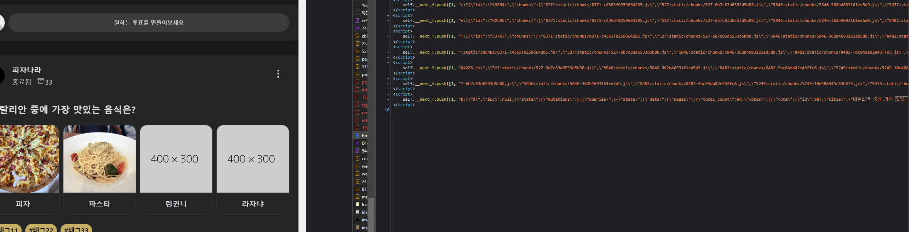

# React-Query 정리

## React-Query

React-Query는 기존 Zustand나 Recoil 혹은 Redux와 같은 상태 관리 라이브러리에서 어려운 점들을 해소할 수 있도록 도와주는 라이브러리다. 기존의 상태 관리 라이브러리들은 충분히 훌륭하지만 서버측 상태관리를 하기엔 그다지 적합하지 않은 부분들이 있기 때문에 React-Query를 사용하게 된다.

예를 들어서 서버의 데이터를 변조한다던가 새로 데이터를 가져와야 할때 등 그런 상태들을 관리하게 해야 한다면 기존의 상태 관리 라이브러리들은 불편한 점들이 존재한다.

따라서 클라이언트측 상태 관리보다 데이터베이스에 저장되어 있는 데이터와 같은 서버 상태를 관리해야한다면 React-Query를 사용하는게 좋다.

## Tanstack에서 주장하는 React-Query의 장점

- 캐싱 (Tanstack의 말로는 프로그래밍에서 아마 가장 어려운 일이라고 한다.)
- 동일한 데이터에 대한 여러 요청을 단일 요청으로 중복 제거
- 백그라운드에서 “오래된” 데이터 업데이트
- 데이터 업데이트를 가능한 빠르게 반영
- 페이지네이션 및 데이터 지연 로드와 같은 성능 최적화
- 서버 상태의 메모리 및 가비지 수집 관리
- 구조 공유를 사용하여 쿼리 결과를 메모

### QueryClient

```tsx
import { QueryClient } from "@tanstack/react-query";

const queryClient = new QueryClient({
  defaultOptions: {
    queries: {
      staleTime: Infinity,
    },
  },
});

await queryClient.prefetchQuery({ queryKey: ["posts"], queryFn: fetchPosts });
```

- QueryClient를 통해 캐시와 상호작용을 할 수 있다.
- QueryClient의 queries 혹은 mutation에 기본 옵션을 여러가지 설정 할 수 있으므로 공식문서를 참고해보도록 하자.
- 사용하기 위해서는 QueryClientProvider를 최상단에서 감싸주면 된다.
- 이 프로젝트에서는 Next.js 13.4를 사용하고 있기 때문에 글로벌 layout에 use client를 사용한 provider 컴포넌트로 한번 감싸서 작성 해주었다.

```tsx
"use client";
import React, { useState } from "react";
import { QueryClient, QueryClientProvider } from "@tanstack/react-query";
import { ReactQueryDevtools } from "@tanstack/react-query-devtools";

type providerType = {
  children: React.ReactNode;
};

const Provider = ({ children }: providerType) => {
  const [queryClient] = useState(new QueryClient());

  return (
    <QueryClientProvider client={queryClient}>
      <ReactQueryDevtools initialIsOpen={false} />
      {children}
    </QueryClientProvider>
  );
};

export default Provider;
```

- 추가적으로 이 프로젝트에선 데브툴을 사용하기 때문에 ReactQueryDevtools 또한 추가 해놓았다.

공식문서 [https://tanstack.com/query/v4/docs/react/reference/QueryClient](https://tanstack.com/query/v4/docs/react/reference/QueryClient)

### 캐시

- 리액트 쿼리는 기본적으로 캐시를 이용해 데이터가 Fresh한 상태인지 판별하고 Fresh하지 않다면 다시 데이터를 가져오려고 시도한다.
- Fresh하지 않다고 판단하는 경우는 아래와 같다.
  - 쿼리 마운트의 새로운 인스턴스 (쿼리 키에 state를 주고 state가 바뀌는 경우)
  - 다른 곳에 포커스가 되어있다가 다시 브라우저로 돌아오는 경우
  - 네트워크가 다시 연결 되는 경우
  - 개발자가 설정한 시간이 된 경우
- 기본적으로 리액트 쿼리는 3번 정도 데이터를 다시 받아오도록 설정 되어있으며 변경이 가능하다.

### useQuery

- 고유 키에 연결된 비동기 데이터 원본에 대한 선언적 종속성이다. 서버에서 데이터를 받아올 때 사용하는 메서드이다.
- useQuery는 최소 두가지를 만족해야 한다.
  - 쿼리의 고유 키
  - 서버로부터 데이터를 가져올 함수
  ```tsx
  import { useQuery } from "react-query";

  function App() {
    const info = useQuery("todos", fetchTodoList);
  }
  ```
- 고유 키는 애플리케이션 전체에서 쿼리를 다시 가져오고 캐싱하고 공유하기 위해 내부적으로 사용 된다.
- 고유키는 문자열과 배열 두가지를 사용할 수 있다.
- 쿼리에서 불러오는 결과의 상태는 다음과 같이 불러올 수 있다.

```tsx
function Todos() {
  const { isLoading, isError, data, error } = useQuery("todos", fetchTodoList);

  if (isLoading) {
    return <span>Loading...</span>;
  }

  if (isError) {
    return <span>Error: {error.message}</span>;
  }

  // We can assume by this point that `isSuccess === true`
  return (
    <ul>
      {data.map((todo) => (
        <li key={todo.id}>{todo.title}</li>
      ))}
    </ul>
  );
}
```

### useMutation

- useMutation은 서버의 데이터를 변경할 때 주로 사용 되며 useQuery와 비슷하게 작성할 수 있다.
- useMutation은 mutate 메서드를 이용해서 요청 함수를 호출 할 수 있다.
- mutate는 onSuccess, onError 메서드를 통해 성공 햇을 시, 실패 했을 시 response 데이터를 핸들링할 수 있다.

### staleTime

- 데이터를 허용하는 최대 주기 혹은 데이터를 얼마나 가지고 있을지 허용하는 시간
- 예를 들어 블로그 같은 경우 데이터를 받아온지 1분이 지나도 상관 없다. 그런 경우 staleTime을 1분으로 설정한다. 1분이 지난다면 만료된 데이터로 판단하고 stale 상태로 변경한다.
- useQuery의 3번째 인자로 넣을 수 있으며 기본 값은 0이기 때문에 항상 데이터를 가져온 직후 만료된 데이터라고 리액트 쿼리는 판단한다. 이는 항상 사람들에게 정보를 제공할 때 최신의 데이터를 가져오도록 하는게 낫기 때문이다.

### cacheTime

- cache는 나중에 다시 가져올지도 모르는 데이터다.
- 특정 쿼리에 대한 활성 useQuery가 없는 경우 해당 데이터는 콜드 스토리지로 이동한다.
- 구성된 cacheTime이 지나면 사라지는데 기본값은 5분이다.
  - 특정 쿼리에 대한 useQuery가 활성화 된 후 경과한 시간 기준
- 캐시가 만료되면 가비지 컬렉션이 작동하고 데이터는 삭제된다.
- 데이터가 캐시에 있는 동안 페칭할 떄 사용될 수 있다.
  - 데이터를 가져올 때 빈페이지 혹은 깜빡 거리는 화면을 보여주기 보단 오래된 데이터를 보여주는 편이 나을 수 있다. 그럴 때 사용한다.
  - 만약 그럴 필요가 없다면 cacheTime을 0으로 설정 하면 된다.

### Prefetching

사용자에게 필요한 데이터를 미리 가져올 수 있다. prefetchQuery를 이용하여 사용자에게 필요한 데이터를 미리 전달이 가능하다.

```tsx
const prefetchTodos = async () => {
  // The results of this query will be cached like a normal query
  await queryClient.prefetchQuery({
    queryKey: ["todos"],
    queryFn: fetchTodos,
  });
};
```

### SSR 대응

SSR을 대응하도록 하면 데이터를 미리 서버측에서 가져와서 클라이언트측으로 보내기 때문에 클라이언트 측에서는 빠른 로딩이 가능하다.

두가지 방법이 있는데 이 프로젝트에서는 Hydrate를 사용한 만큼 Hydrate를 사용하는 방법에 대해 설명하고자 한다.

시작하기전 Hydrate와 dehydrate에 대해 알아두고 시작하면 이해하기 쉽다.

hydrate는 사전적 단어로는 수분 공급이라는 뜻이며 Next.js에서는 먼저 정적인 페이지를 렌더링 한 후 동적인 페이지를 만드는 과정을 뜻한다. 반대로 dehydrate는 캐시의 동결된 표현을 생성하여 Hydrate를 사용할 수 있도록 처리해주는 과정을 의미한다. (정적인 페이지를 만들어서 hydrate 할 수 있게끔 처리한다는 의미)

관련 공식 문서: [https://tanstack.com/query/v4/docs/react/reference/hydration](https://tanstack.com/query/v4/docs/react/reference/hydration)

- 먼저 싱글톤 패턴으로 QueryClient를 작성한다. 이렇게 하면 딱 하나의 QueryClient만 생성이 가능하다.

```tsx
// app/getQueryClient.jsx
import { QueryClient } from "@tanstack/react-query";
import { cache } from "react";

const getQueryClient = cache(() => new QueryClient());
export default getQueryClient;
```

- 데이터를 뿌려줄 클라이언트 측 컴포넌트보다 서버 사이드로 돌아가는 부모 컴포넌트에서 데이터를 가져온다. 미리 가져온 쿼리는 모든 자식 컴포넌트에서 사용할 수 있다.
  - 싱글톤으로 만들어진 QueryClient를 불러온다.
  - 클라이언트의 prefetchQuery 메서드를 사용하여 데이터를 미리 가져오고 완료될 때까지 기다린다.
  - dehydrate메소드를 사용하여 쿼리 캐시에서 미리 가져온 쿼리의 dehydrate 상태를 가져온다.
  - 내부에 프리페치된 쿼리가 필요한 자식 컴포넌트를 Hydrate 컴포넌트로 감싸서 dehydrate 상태를 제공한다.
  - <Hydrate>는 여러 서버 컴포넌트에서 가져와 여러 위치에서 사용할 수 있다.

```tsx
import { dehydrate, Hydrate } from "@tanstack/react-query";
import getQueryClient from "../../getQueryClient";

export default async function HydrateDetail({ postId }: { postId: number }) {
  const queryClient = getQueryClient();
  // ["voteDetail",postId] query key를 기준으로 api 요청한 데이터를 queryClient에 넣는다.
  await queryClient.prefetchQuery(["voteDetail", postId], async () => {
    const response = await voteDetailFetch(postId);
    return response.res;
  });
  // dehydratedState에 queryclient 상태를 정의하고(api로 받아온 정보가 들어가 있음)
  const dehydratedState = dehydrate(queryClient);

  return (
    // client에서 hydrate를 받을 때 SSR 당시 만들어두었던 dehydratedState 를 받는다.
    <Hydrate state={dehydratedState}>
      <VoteDetailItem postId={postId} />
    </Hydrate>
  );
}
```

<aside>
💡 TypeScript를 사용중이라면 비동기 서버 컴포넌트를 작성하면 유형 오류에 대해 불평합니다. 임시적으로 ***{/* @ts-expect-error Server Component */}***를 현재 작성중인 Hydrate 컴포넌트 부모에 작성해서 막을 수 있다.
</aside>
<br>

그 결과로 아래 그림에서 볼 수 있듯이 왼쪽 페이지 내용을 react-query의 prefetching을 통해 api요청으로 가져온 데이터의 dehydrate 한 결과를 SSR된 페이지에서 볼 수 있다.



```
const VoteDetail = ({
  params,
}: {
  params: { detail: string; lng: Locale };
}) => {
  return (
    <div
      className={
        "VoteDetail mt-10 mb-10 h-full w-full rounded-2xl border px-[5%] shadow-md dark:border-border-dark "
      }
    >
      {/* @ts-expect-error Server Component */}
      <HydrateDetail postId={params.detail} />
      <PicketArea />
      <CommentListArea />
    </div>
  );
};
```

서버 렌더링 중 클라이언트 구성 요소 useQuery내에 중첩된 호출은 Hydrate의 state 속성에 있는 프리페칭 데이터에 액세스 할 수 있다.

위 경우엔 VoteDetailItem 컴포넌트에서 useQuery를 통해 이미 가져온 데이터에 접근 할 수 있다.

```tsx
"use client";
const VoteDetailItem = ({ postId }: { postId: number }) => {
  // 서버 컴포넌트에서 미리 가져온 데이터를 사용할 수 있다.
  const { data } = useVoteDetailQuery({
    queryKey: "voteDetail",
    postId: postId,
  });

  const { data: voteCheck } = useVoteCheckQuery({
    queryKey: "voteCheck",
    postId: postId,
  });

  //...이하 생략
};
```

공식 문서에서는 쿼리의 일부만 미리 가져오고 다른 쿼리는 클라이언트에서 가져오도록 하는것을 추천하고 있다.

특정 쿼리에 대한 prefetchQuery를 추가하거나 제거하여 서버가 렌더링 하는것을 제어하라는 의미다.
